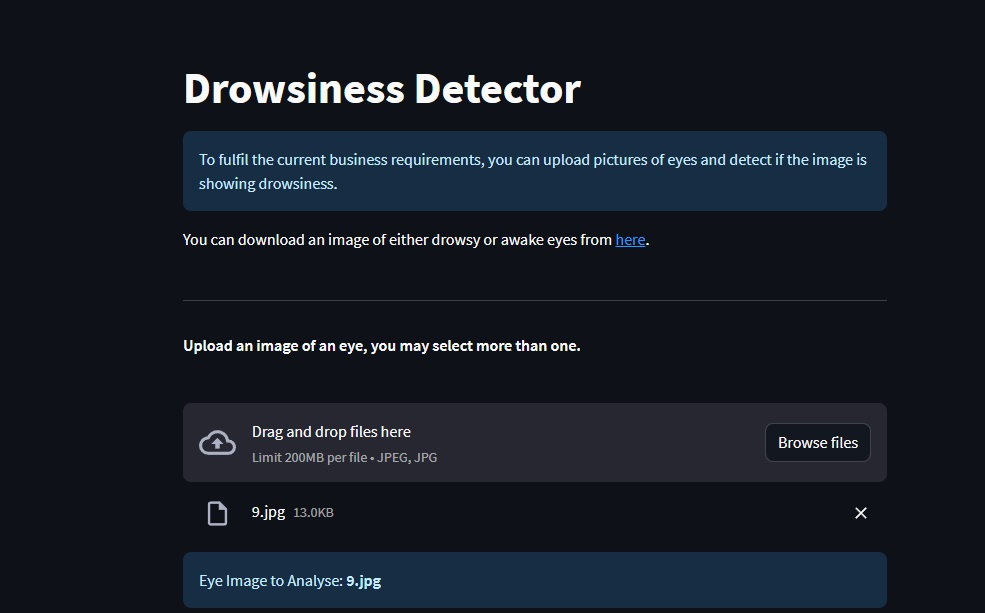

# Drowsiness Detector

## Table of Contents
1. [Dataset Content](#dataset-content)
2. [Business Requirements](#business-requirements)
3. [Hypothesis and Validation](#hypothesis-and-validation)
4. [Model Rationale](#model-rationale)
5. [Business Requirements Rationale and Mapping](#business-requirements-rationale-and-mapping)
6. [Machine Learning Business Case](#machine-learning-business-case)
7. [Dashboard Design](#dashboard-design)
8. [Unfixed Bugs](#unfixed-bugs)
9. [Deployment](#deployment)
10. [Technologies Used](#technologies-used)
11. [Credits](#credits)
12. [Acknowledgments](#acknowledgements)

### Deployed Dashboard [here](https://drowsiness-detector-2d6e5a9a5e32.herokuapp.com/)

## Dataset Content
The dataset contains 9869 featured photos of computer generated eyes showcasing various stages of drowsiness against a neutral background, and also fully alert and awake eyes. Drowsiness while driving is a perilous condition that can lead to severe accidents and loss of lives. It can affect anyone behind the wheel but [studies](https://www.ncbi.nlm.nih.gov/pmc/articles/PMC1757738/) show that a large part of vehicular accidents due to tiredness or drowsiness occurs with occupational drivers such as the drivers of lorries, goods vehicles, and company cars. The dataset is sourced from [Kaggle](https://www.kaggle.com/datasets/hazemfahmy/openned-closed-eyes).

## Business Requirements
In an era where the number of vehicular accidents due to drowsy driving is on the rise, EyeVigil Systems Inc. has identified a critical need for a state-of-the-art machine learning system. We have been hired by EyeVigil Systems to provide a 'proof of concept' showing that machine learning is capable of analysing the human eye, and based upon its 'openness' determine if it is showing signs of drowsiness. This project has three Business Requirements, a study to visually identify drowsy drivers, accurate prediction of driver drowsiness, downloadable drowsiness prediction report. Successfully fulfilling these will provide proof of concept and thus allow for further development, with the end goal of providing a real-time video machine learning system to detect drowsiness. Below the Business Requirements are outlined further.

1. A Study to Visually Identify Drowsy Drivers:

The system will perform image analysis on images to visually differentiate between alert and drowsy drivers. It will study the 'openness' of drivers' eyes to identify signs of drowsiness.

2. Accurate Prediction of Driver Drowsiness:

The drowsiness detection model will be developed as a binary classifier to accurately predict whether a given driver is drowsy or not based on their eye images. The model will utilize machine learning algorithms and computer vision techniques to achieve high accuracy in identifying drowsiness in drivers.

3. Downloadable Drowsiness Prediction Reports:

Upon analyzing a driver's eye images, the system will generate a comprehensive prediction report for each examination. The report will include details such as the date and time of the examination, the prediction result (Drowsy or Awake), and the associated probability. The report will be downloadable in a user-friendly format for record-keeping and further analysis.

## Hypothesis and Validation
* Hypothesis 1:

Drowsy individuals tend to have more closed eyes compared to alert individuals.

* Validation:

To validate this hypothesis, we analyze the average eye openness of drowsy and alert individuals from the dataset. Using Machine Learning we should be able to determine that the average openness of drowsy eyes is significantly lower than alert eyes. We can see this through the Average Image and Variability Images.

* Hypothesis 2:

There is a visual pattern that can be learned by a machine learning model to classify drowsy and alert eyes with an accuracy of at least 90%.

* Validation:

To validate this hypothesis, we train a machine learning model on the dataset and evaluated its performance. Should the model achieve an accuracy greater than 90% for the test set, then the client will consider this to be a validated hypothesis. 

## Model Rationale

To help choose the optimal hyperparameters I implemented the uses of a Keras Tuner. Below I will go through each of the hyperparameters in detail. 

<u>Convolutional Layers:</u>

The model has three convolutional layers which are instrumental for analyzing image data because they capture spatial hierarchies of features.
With multiple convolutional layers, the model learns increasingly complex features. The initial layers likely detect basic features like edges and textures. Deeper layers can recognize more intricate patterns that might be directly associated with the state of the eye (drowsy or awake).

<u>Activation Function - ReLU:</u>

The ReLU activation function introduces non-linearity in a computationally efficient manner.
Using ReLU helps prevent the vanishing gradient problem during backpropagation.

<u>MaxPooling Layers:</u>

After each convolutional layer, a MaxPooling layer is used to downsample the feature maps.
This reduces computational requirements and captures the essential features.

<u>Flatten Layer:</u>

This layer is used to transform the 3D output from preceding layers into a 1D vector, suitable for dense layers.

<u>Dense Layers and Hyperparameter hp_units:</u>

Based on the results of the hyperparameter search, the optimal number of units in the dense layer was found to be 320.
This specific choice strikes a balance between model complexity and the risk of overfitting. Having 320 units allows the model to capture a good amount of information without becoming overly complex.

<u>Dropout Layer:</u>

A rate of 0.5 means approximately half of the input units to this layer will be dropped out at each training step, promoting generalization and preventing overfitting.

<u>Output Layer:</u>

The model uses a sigmoid activation function, ideal for binary classification (awake or drowsy).

<u>Learning Rate and Hyperparameter hp_learning_rate:</u>

The optimal learning rate for the optimizer, based on the search results, is 0.001.
This learning rate provides a balance between convergence speed and the risk of overshooting the optimal values during training. The result from the hyperparameter search suggests that a learning rate of 0.001 allows for stable and effective training on the given dataset.

<u>Optimizer - Adam:</u>

Adam is an effective choice due to its adaptive learning rate properties. It adjusts the learning rate for each parameter, facilitating faster convergence without overshooting.

<u>Loss Function - Binary Crossentropy:</u>

Suitable for binary classification, it measures the difference between the actual and predicted probabilities.

The results from the hyperparameter tuning, specifically the selection of 320 units for the dense layer and a learning rate of 0.001, indicate the configurations that provided the best performance on the validation data for this specific task of differentiating between awake and drowsy eye images. This optimization ensures that the model is neither too simple (and underfits the data) nor too complex (and overfits), and it learns at an optimal pace given the data's characteristics.

## Business Requirements Rationale and Mapping
### Business Requirement 1: A Study to Visually Identify Drowsy Drivers
* The system will perform image analysis on images to visually differentiate between alert and drowsy drivers. It will study the 'openness' of drivers' eyes to identify signs of drowsiness.
- As a client, I want to view average images and image variances for 'awake' and 'drowsy' eyes, so I can determine the visual difference between the two. 
- As a client, I want to see a collection of images from each category so I can see a standard collection of the categories. 

The User Stories above weere addressed in the implementation of the following...
 1. The Data Visualation page in the Streamlit dashboard web tool developed. 
 2. Within the Data Visualization page the user can see both Average Variabily and Mean and Difference between the two categories. 
 3. Also within the Data Visualization page the user can view an image of a montage of each category, comprised of random images from each. 
### Business Requirement 2: Accurate Prediction of Driver Drowsiness
* The drowsiness detection model will be developed as a binary classifier to accurately predict whether a given driver is drowsy or not based on their eye images. The model will utilize machine learning algorithms and computer vision techniques to achieve high accuracy in identifying drowsiness in drivers.
- As a client, I want to be able to access a machine learning tool, so that I can aquire a predicted state of an eye based on the image provided.
- As a client, I want to be able to view the prediction probabilty, so that I can assess the potential accuracy.
- As a client, I want the machine learning tool to have an accuacy of at least 90%, so that I can accertain if this model can be developed further.
- As a client, I want to be able to upload multiple images, so that I can have a report generated for multiple images at one time.

The User Stories above were addressed in the implemntation of the following...
 1. The Drowsiness Detector page allows for users to upload images, single or multiple at a time.
 2. The paage, once an image has been uploaded, displays the prediction under the image. 
 3. A graph is provided that shows the percenage of probabilyt for an accurate prediction. 
 4. The Project Machine Learning Performance page has a table that shows the Loss and Accuracy of the model. 
### Business Requirement 3: Downloadable Drowsiness Prediction Reports
* Upon analyzing a driver's eye images, the system will generate a comprehensive prediction report for each examination. The report will include details such as the date and time of the examination, the prediction result (Drowsy or Awake), and the associated probability. The report will be downloadable in a user-friendly format for record-keeping and further analysis.
- As a client, I want to be able to easily download a report of the model prediction, so I can record the predictions that have been made. 

The User Stories above were addressed in the implemntation of the following...
 1. The Drowsiness Detector page allows for users to download the full report of the predictions for any and all of the images they upload to the detector rool

## Machine Learning Business Case

* The goal of this project is to leverage machine learning to create a drowsiness detector that can alert drivers when signs of drowsiness are detected, ensuring roads are safer.The drowsiness detector will also be a two/multi-class, single-label, classification model where the two primary classes would be "Awake" and "Drowsy." 

* Our ideal outcome is to provide a reliable proof of concept, that a machine learning tool can detect early signs of drowsiness and differentiate between it and alert. 

* Success Metrics: The model should have an cccuracy of 90% or above on the test set.

* The output should be a clear indication of whether the person is "Awake" or "Drowsy" along with the associated probability of the prediction. This real-time prediction will provide immediate feedback to the user.

* Currently, many vehicles come with basic drowsiness alert systems that often use steering pattern recognition. However, this method is not foolproof and often results in false alarms or misses real drowsiness events. Other methods include manual self-assessment by drivers, but this is highly unreliable as a person's judgment may be impaired when they are drowsy. If this provides proof of concept further development will result in a realtime analysis of the driver and the visual signs of drowsiness. 

* The dataset used for the proof of concept was provided from Kaggle, linked in the Dataset Content section of this ReadMe file. 

## Dashboard Design
The dashboard for this project was developed using Streamlit. It consists of five pages, Project Summary, Drowsiness Visualization, Drowsiness Detector, Project Hypothesis, and Project Machine Learning Performance. 
### Home Page-Project Summary
This page contains information about the project such as the general purpose behind the project, information about the dataset used, and a list of the business requirements. 

Show Project Summary

### Drowsiness Visualization
The Drowsiness Visualization page first displays the variability between 'awake' and 'drowsy' eyes while also showing the mean or average image of each, and displaying the difference between those averages. 

Show Average and Variabilty

Show Average 'Awake' and 'Drowsy', and Difference

 
This page also displays a montage of random images fro both Awake and Drowsy labels, allowing the user to choose in a dropdown which of the two they want to view.

Show Montage

### Drowsiness Detector
This page allows users to upload images from the dataset to test if the eye is either 'Awake' or 'Drowsy'. A link is provided to the original dataset alowing the user to download the images for the detector to use. Once uploaded the page will make an analysis and prediction of its state, either 'Awake' or 'Drowsy'.

Show Detector

Below you can see an image uploaded for evaluation. It is a single image, but multiple can be uploaded as well. 

Show Montage

After upload, a pridiction will be made. It will also display the probabilty of the accuracy of the predicion and for each image provide a report. The report is also downloadable by clicking the link 'Download Report'. 

Show Prediction

### Project Hypothesis
This page displays the projects hypotheses and the conclusion in regards to the finds and model training. 

Show Hypotheses

### Project Machine Learning Performance
This page displays the distribution of the data, as well explaining the different types of accuracy and loss and plotting accordingly, also providing a confusion matrix and other performance metrics. 

The graph shows the total number of images in the data set and how they have been divided between test, train, and validate, and the ratio of the division. 

Show Image Distribution

There are two graphs that are showing the model performance in terms of the Accuracy and Loss.

Show Accuracy

Show Loss

The final graph on the page is the confusion matrix, as well as an explanation of the graph. There is also a small chart that shows the general performance of the model in terms of Loss and Accuracy. 

Show Prediction

## Unfixed Bugs
There are currently no unfixed or known bugs. 

## Deployment
### Heroku

* The App live link is: https://drowsiness-detector-2d6e5a9a5e32.herokuapp.com/
* Set the runtime.txt Python version to a [Heroku-20](https://devcenter.heroku.com/articles/python-support#supported-runtimes) stack currently supported version.
* The project was deployed to Heroku using the following steps.

1. Log in to Heroku and create an App
2. At the Deploy tab, select GitHub as the deployment method.
3. Select your repository name and click Search. Once it is found, click Connect.
4. Select the branch you want to deploy, then click Deploy Branch.
5. The deployment process should happen smoothly if all deployment files are fully functional. Click now the button Open App on the top of the page to access your App.
6. If the slug size is too large then add large files not required for the app to the .slugignore file.

### Forking the GitHub Project
To make a copy of the GitHub repository to use on your own account, one can fork the repository by doing as follows:

1. On the page for the repository, go to the 'Fork' button on the top right of the page, and click it to create a copy of the repository which should then be on your own GitHub account.

### Making a Local Clone
1. On the page for the repository, click the 'Code' button
2. To clone the repository using HTTPS, copy the HTTPS URL provided there
3. Open your CLI application of choice and change the current working directory to the location where you want the cloned directory to be made.
4. Type git clone, and then paste the previously copied URL to create the clone

## Technologies Used
### Platforms
* Heorku
* Jupyter Notebooks
* Kaggle
* GitHub
* VSCode 
### Languages
* Python
* Markdown
### Data Analysis and Machine Learning Libraries
* Numpy
* Pandas
* Matplotlib
* Seaborn
* Plotly
* Streamlit
* Scikit-learn
* Tensorflow
* Keras

## Credits 

### Content 
* Dataset from user [hazemfahmy](https://www.kaggle.com/hazemfahmy) on Kaggle

### Code
* Template used belongs to [CodeInstitute](https://github.com/Code-Institute-Solutions/milestone-project-bring-your-own-data)
* Walkthrough Project 1 was used as the skeletal structure of this project
* Keras Tuning structer learned from [TensorFlow](https://www.tensorflow.org/tutorials/keras/keras_tuner) resources

## Acknowledgements
This is my final project, and as such I have many people to thank...
 * My wonderful partner, Leo. Through this entire process you have been fighting in my corner and cheering me on. You have always believed I can do anything and you have been my rock. I love you, and thank you.
 * My supportive housemate, Trevor. You have stepped up many times to help where you shouldn't need to but did anyway. You have supported me and Leo through a lot this last year. Thank you for being dependable and helping. 
 * My mentor, Mo. You are a rockstar. You have taken time out of your busy day to help encourage me and gas me up to tackle things I didn't think I could. You have been everything a person coudl want in a mentor and I appreciate every ounce of energy and advise you gave me. Thank you so much.
 * The my friends, Oskar, Patrik, and Mark, you all have been so supportive and encouraging and understanding when I have to be locked away for weeks typing away instead of hanging out. But, you all believed in me and made me feel like I could do it. Thank you.  

